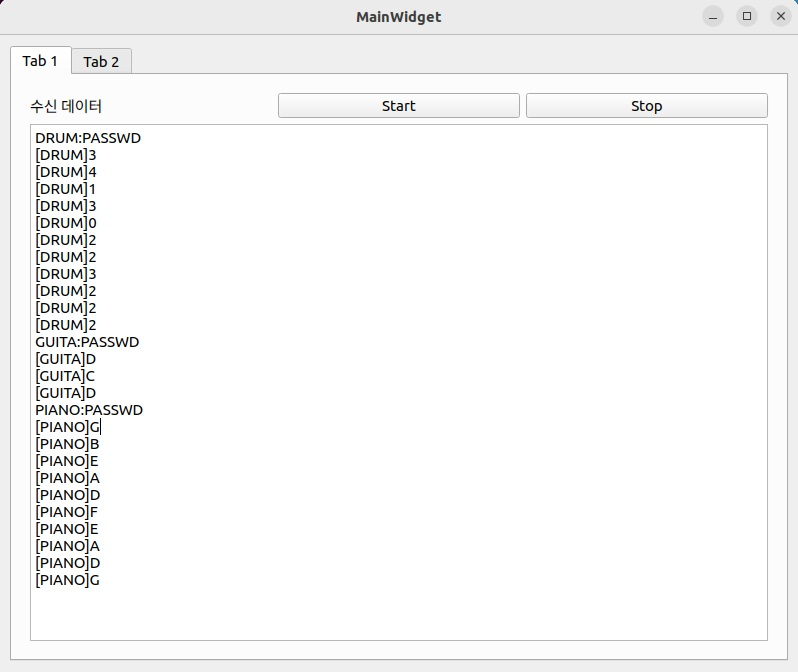
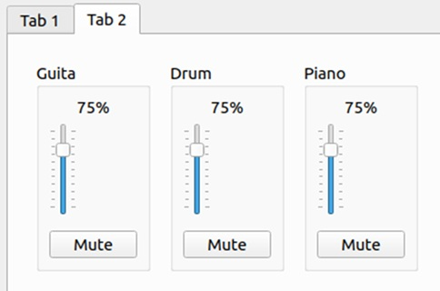
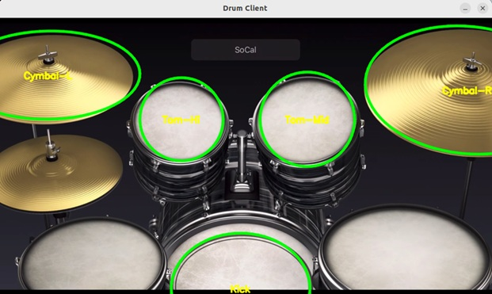
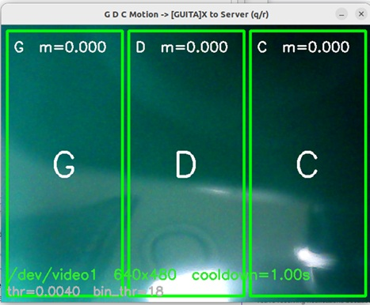
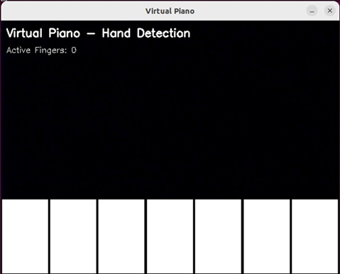

# Remote Band

**Remote Band** <br>프로젝트는 OpenCV(C++/Python) 기반의 영상 인식 기술을 활용하여 손가락 움직임을 악기 연주 동작으로 변환합니다.


## 주요 기능

- **OpenCV 기반 악기 인식**  
  - OpenCV로 제작한 가상 악기에서, 웹캠을 통해 바운딩 박스 안으로 들어오는 손이나 물체의 움직임을 감지합니다.
- **실시간 명령 전송**  
  - 감지된 연주 동작을 TCP 소켓 통신을 통해 QT 기반 서버에 명령(프로토콜) 형태로 전송합니다.
- **QT 오디오 서버**  
  - 서버에서는 각 악기의 명령을 받아 오디오를 합성해 출력하며, 음소거(Mute) 및 볼륨 조절 기능을 제공합니다.


## 팀 구성 및 역할

| 팀원 | 역할 |
| :---: | :--- |
| [서우진](https://github.com/Woojin5020) | GitHub 병합 및 레포지토리 관리<br>QT 오디오 볼륨 조절 UI 개발 개발<br>OpenCV 기반 드럼 개발 |
| [윤동준](https://github.com/yundongjun) | QT/악기 클라이언트 간 TCP/소켓 통신 서버 개발<br>OpenCV 기반 기타 개발 |
| [이진우](https://github.com/LeeJinWoo537) | OpenCV 기반 전자 피아노 개발 |

---

## 환경 구성

### 테스트 환경
- Ubuntu : 22.04.05 LTS
- QT : 5.15.3
- openCV : 4.12.0

### 실행 방법
- QT_Server 실행
  ```
  ./QT_Server/QT_Server
  ```
  - 앱이 뜨면 Start 버튼을 눌러 소켓 서버를 시작합니다.

- 드럼 - 실행
  ```
  ./drum/openCV_project_Drum/drum_server_socket/drum
  ```

- 드럼 - IP 변경 방법
  ```
  vi drum/openCV_project_Drum/drum_server_socket/drum.cpp
  
  138  string server_ip    = (argc>=2)? argv[1] : "10.10.16.55";
  ```


- 기타 - 실행
  ```
  ./guita/build.sh
  ```

- 기타 - IP 변경 방법
  ```
  vi guita/main.cpp
  
  22  static string SERVER_IP   = "10.10.16.55";
  ```


- 피아노 - 실행
  ```
  ./piano/VirtualPiano/build.sh
  ```

- 피아노 - IP 변경 방법
  ```
  vi piano/VirtualPiano/src/main.cpp
  
  130  static inline const char* HOST = "10.10.16.55";
  ```

---

## 실제 사용자 화면
- QT_Server_Tab1(세션 클라이언트 명령 수신 화면) 
  

- QT_Server_Tab2(세션 볼륨 조절 화면)  
  

- Drum(드럼 세션 사용자 화면)  
  

- Guitar(기타 세션 사용자 화면)  
  

- Piano(피아노 세션 사용자 화면)  
  